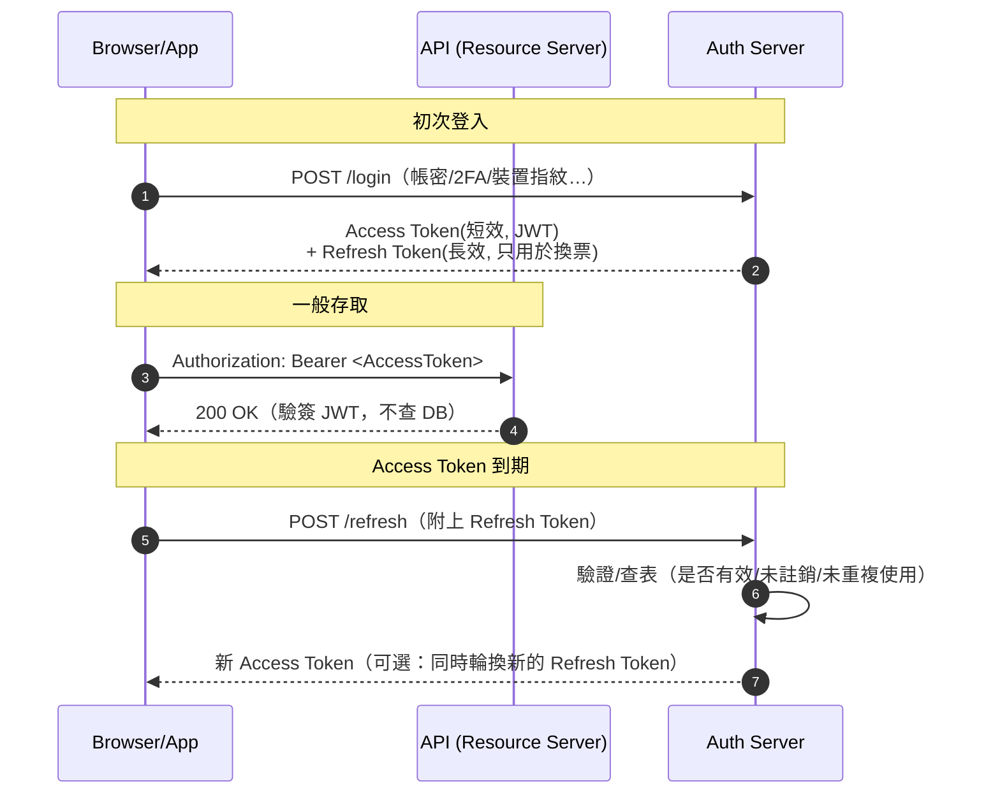
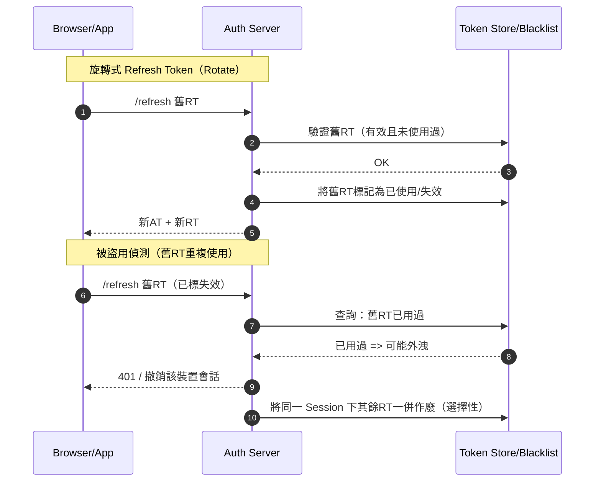

# JWT 概念

JWT（JSON Web Token）由三個 Base64URL 編碼的部分組成，以 `.` 連接：

```
Header.Payload.Signature
```

---

## 三個部分

### Header

```json
{ "alg": "HS256", "typ": "JWT" }
```

- `alg`：加密演算法（HMAC、SHA256、RSA）
- `typ`：固定為 `JWT`

### Payload（聲明 / Claims）

Payload 以 Base64 編碼（**非加密，可被解碼**），不應存放機密資料。

標準 Registered Claims：

| 欄位 | 說明 |
|---|---|
| `iss` | 簽發人 (issuer) |
| `exp` | 過期時間 (expiration time) |
| `sub` | 主題 (subject) |
| `aud` | 接收人 (audience) |
| `nbf` | 開始生效時間 (not before) |
| `iat` | 簽發時間 (issued at) |
| `jti` | JWT ID |

### Signature

```
HMACSHA256(
  base64UrlEncode(header) + "." + base64UrlEncode(payload),
  your-256-bit-secret
)
```

Signature 用來驗證 Header + Payload 未被篡改。`secret` 存放於伺服器端，不對外暴露。

---

## 一般存取流程



---

## Refresh Token 輪換（Rotate）與盜用偵測


